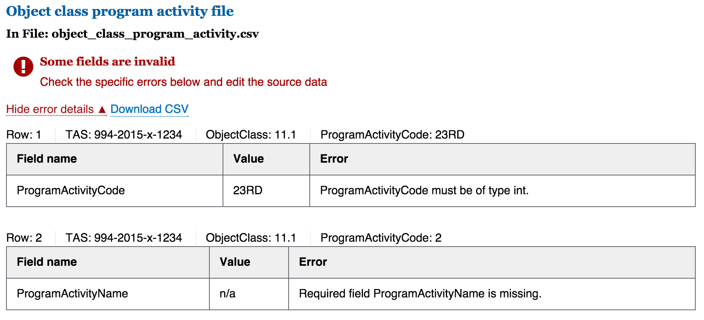

# Using the DATA Act Broker Prototype

Welcome! If you're a U.S. federal employee who wants to explore this early prototype of the DATA Act broker, you're in the right place.

## What Can I Do Here?

The hosted version of the prototype is a sandbox where you can run your agency's DATA Act data through an early version of the validation and conversion process.

The pilot team prioritized understanding how the agency data submission process might work and getting early feedback over building a fully-featured product. Thus, the resulting prototype website is a [_minimum viable product_](https://en.wikipedia.org/wiki/Minimum_viable_product "minimum viable product"). It's purpose is to provide something concrete for agencies to respond to, and we hope you'll give it a try and [let us know what you think](CONTRIBUTING.md "give feedback or ask a question about the DATA Act broker pilot").

 Official DATA Act guidance will continue to evolve, so the broker prototype doesn't represent the final version of the agency submission process, and the validations it performs aren't comprehensive.

What agencies can use the prototype website for:
* A better understanding of what the submission process might look like.
* A chance to [provide feedback](CONTRIBUTING.md "give feedback or ask a question about the DATA Act broker pilot") on this process and the experience of using the broker.
* A first, high-level validation check of their files created for the DATA Act.

For a more comprehensive background about the project and submission process we're testing, [watch the pilot's screencast](#).
**TODO:** add link for updated version of the screencast.

## How to Use the Broker Prototype Website

The broker prototype website is open to federal employees. If you're not a federal employee, sorry about that - it's a security restriction. The screencast provides a good overview of the site.

### Prepare Your Data

If you've made progress on data inventory and mapping, you should be able to create the four data files used in this pilot. Even going through the process with just one or two awards will be a useful way to get started and get additional insights into your agency's readiness.

The pilot currently expects DATA Act data in four separate files:

1. Appropriation
2. Object Class Program Activity
3. Award
4. Award Financial

These files roughly correspond to the _Relationships_ diagram in the _Data Act Elements Guidance_ published by Treasury and [available on MAX](https://community.max.gov/display/Management/B%3A+DATA+Act+Elements+Guidance "Data Act Elements Guidance"). However, there are a few differences:

* This pilot combines award attributes and awardee attributes into a single file.
* This pilot's scope was the original 83 DATA Act elements, so it doesn't accept or validate the _Additional Required Elements_ from USAspending that are included in Treasury's Data Element Guidance.

To create data files that are compatible with this pilot:

1. Review the pilot's file templates. The _elementMappingName_ column on these templates show the column headings expected in each of the four .csv files.
    * [appropriation.csv](https://github.com/18F/data-act-pilot/blob/master/schema/appropriation.csv)
    * [object_class_program_activity.csv](https://github.com/18F/data-act-pilot/blob/master/schema/object_class_program_activity.csv)
    * [award.csv](https://github.com/18F/data-act-pilot/blob/master/schema/award.csv)
    * [award_financial.csv](https://github.com/18F/data-act-pilot/blob/master/schema/award_financial.csv)

2. For a better idea of what data the website expects, take a look at these sample files filled out with dummy data. **TODO:** make some sample files with dummy data.

3. Based on your system inventory and mapping work, create the four files and populate them with data. The order of the columns in each file doesn't matter, but it's important that the column names match those used shown on the templates and dummy data.

### Submit Data for Validation

This prototype is a sandbox. The website uses anonymized analytics to track overall traffic and usage, but it doesn't track who is logging on, and it won't send or store your data anywhere.

1. Request access to the website. **TODO:** decide who will be fielding these requests and what the process is.
2. Go to the prototype website: https://data-act-pilot-v2.18f.gov/
3. When prompted, enter your _Name_ and _Password_.
4. You should now be on a web page titled _Data Act Pilot_.
5. In the _Validator_ part of the page, look for four boxes titled _Appropriation_, _Object Class Program Activity_, _Award_, and _Award Financial_.

6. In one or more of the four boxes, click _Choose file_ to upload the data you've created.
7. After you click _Choose file_, use the navigation that appears to find the file on your computer and then click _Choose_.

8. After you choose a file, the corresponding box on the main page will let you know you were successful by display the file's name in the box:

9. Continue choosing the files you want to upload and validate. You don't have to upload all four files, but it's important to make sure that the file you choose for each box matches the title. In other words, you can't upload your _Appropriation_ file using the _Award_ box.

10. When you're done selecting the files to validate, click the _Validate me_ button.

11. Once the validations are complete, the broker displays the results on the website.

## Review Validation results

In this early stage of the process, we expect that most files will have some type of validation error. We try to return as much information about each type of error as possible, so don't be alarmed if you see a lot of messages on the screen at this point.

Below the upload boxes, you should now see a _Results_ section on the website. This displays error messages for each of the four files.

### File was not uploaded

The most basic error message is _File was not uploaded_, and this appears for any of the four files you chose not to upload before running validations. This is just a reminder and not a cause for concern.

### File is of incorrect type

The broker checks the format of each file you upload to make sure
* it's a .csv, and
* the column names are correct (order of columns doesn't matter)

If there's a file format problem, you'll see the _file is of incorrect type_ message.

### Some fields are not valid

Once the broker has checked the file format, it runs the file's actual data through a series of [validation rules](VALIDATIONS.md "validation rules").

Click _View error details_ to see the specific errors.

The image above is an example of a simple validation rule that failed: some of the required fields were empty. You'll see a table like this for each row of the uploaded file that contains an error. Here's a few pointers for interpreting these messages:

* Right above the table is some information meant to help track down the data causing the problem:
    * _Row_ is the row number in the uploaded file.
    * Following _Row_ are "key" fields in file. This example is the file that contains obligations and outlays by appropriations account, program activity, and object class. Thus, the error message displays TAS (_i.e._ appropriations account), object class, and program activity to help find the offending data in the source system.
* For each row in the data that didn't pass validations, you'll see one or more _Field names_. This is the name of specific field that didn't pass.
* For each _Field name_, you'll see an _Error_ that describes the problem. In this basic example, we're missing some required data.
