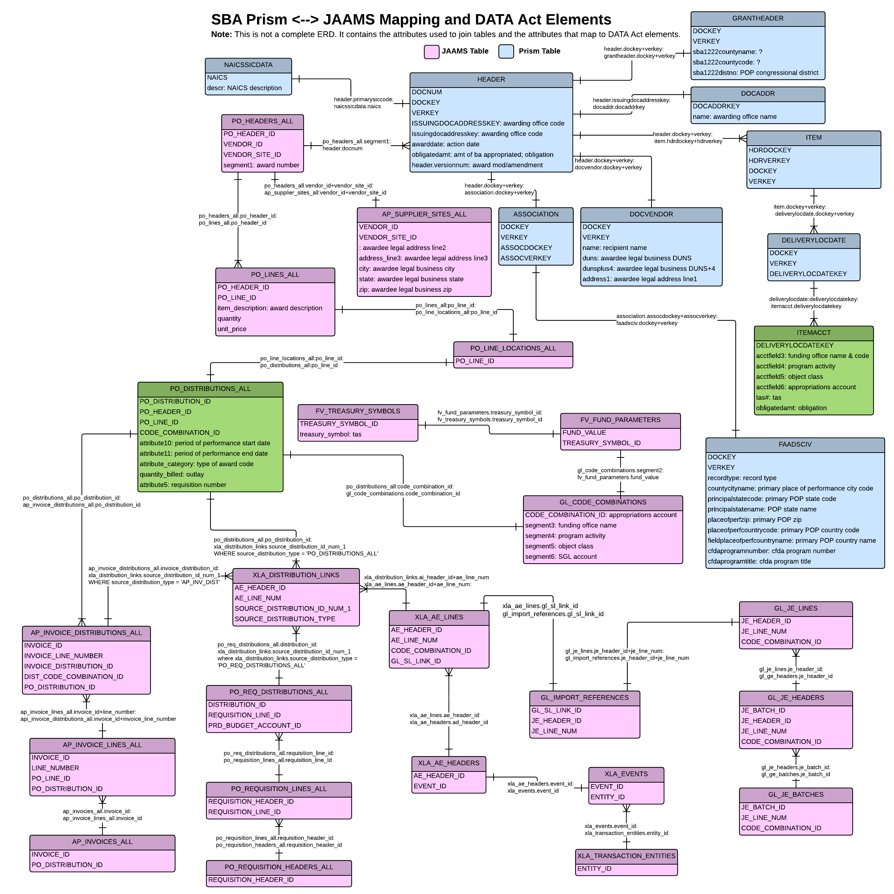

As an SBA user, I need to see the business rules being applied to my source data
    
Business rules or validation rules will be applied to ensure that submitted data by the US Small Business Administration meets the DATA Act criteria. Goals of these validation rules will improve cleanliness, accuracy, and meaningfulness of the data set. Agency submissions will be checked against these rules before the data submission is accepted by Treasury. Below is a draft of proposed rules and are subject to change. 

Validation will occur in *two areas* of intercessor process: 

- The first validation will be step three after the unification of the SBA data. SBA can import unified data through the validation tool that will run standard validation checks and provide feedback on errors raised. 
- The final validation will occur when data is submitted to Treasury. This validation will include both standard authoritative sources checks. 
    
**Standard validation**

*Required fields:* 
- Required field validation ensures that users input data in required fields. If required field is empty, an error will be raised. [DATA act schema](https://github.com/18F/intercessor/blob/master/schema/data-act-schema.png) documents the required fields.

*Data types:*
- Data type validation ensures that the data types match with the [DATA Act schema](https://github.com/18F/intercessor/blob/master/schema/data-act-schema.png) . For example, `parentAward` data type required is a string. If a number is entered an error will be raised. 

**Awardee validation:**  

*Award id:*
- Award id validation ensures that `Award id` is an exact number length (if it is not blank). This length can be determined and set. Additionally, award id validation ensures DUNSNumber and SAM number match. If either of those criteria are not met an error will be raised.

*Address:* 

- Address validation ensures that users input data in the Awardee Address fields. If address fields are empty, an error will be raised. 
- State and zip codes validation will ensure that Awardee Zip/Postal Code is valid by looking up the first five characters of the value in a zip code object that contains a record for every valid zip code in the US. If the zip code is not found in the zip code object, an error will be raised. 

*Business type:*

- The Business type two-position numeric code depicts the type of recipient or borrower. Business Type validation ensures that:
    - the numeric code is the exact number length of two. If business type is empty and is not the exact number length, an error will be raised. 
    - the two position numeric code depicts the correct type of recipient or borrow. If business type is not accurate in the business type object, an error will be raised. Below are the following business types: 
    - Government codes:
        - 00 = State government
        - 01 = county government
        - 02 = city or township government
        - 04 = special district government
        - 05 = independent school district
        - 06 = State controlled institution of higher education
    - Nonprofit agencies:
        - 11 = Indian tribe
        - 12 = other nonprofit
    - Private:
        - 20 = private higher education
        - 21 = individual
        - 22 = profit organization
        - 23 = small business
        - 25 = all other
    
**Authoritative sources:** 

The following fields will be validated against identified authoritative sources. Each source is in various formats: 

- SAM:
    - Legal Business Name
    - Legal Business Identifier Number
    - Ultimate Parent Unique Identifier
    - Legal Business Address
    - Legal Business Congressional District
    - Legal Business Country Code
    - Legal Business Country Name
    - Top 5 Highly Compensated Officer Names
    - Top 5 Highly Compensated Officer Total Compensations
- [OMB - listing of Agency/Bureau and Treasury Codes](https://www.whitehouse.gov/sites/default/files/omb/assets/a11_current_year/app_c.pdf)
    - Awarding Agency Name
    - Awarding Agency Code
    - Treasury Account Symbol (excluding Sub-Account), Appropriations Account, and Agency
    - Agency Name
    - Agency Code
    - Sub Tier  Agency Name
    - Sub Tier  Agency Code
    - Awarding Sub Tier  Agency Name
    - Awarding Sub Tier  Agency Code
- [Object Class](https://www.whitehouse.gov/sites/default/files/omb/assets/a11_current_year/s83.pdf)
- [Catalog of Federal Domestic Assistence](https://www.cfda.gov/) for assistance awards
    - CFDA Program Number
    - CFDA Program Title
- [US Census](http://www.census.gov/eos/www/naics/) 
    - NAICS Code
    - NAICS Description

**Join Rules:**

The following diagram shows the fields used to join the data. In every case, records that don't join with the fields below are dropped from the merged JAAMS/Prism DATA Act file. The only exception is the join to NAICS, because the grant records we're using don't have a NAICS code.

Questions: 

- How do you keep track of changing addresses? 
- In general, how do we want to track data that changes over time?  
- Authoritative sources are in various formats. How will we be able to validate against these sources in the future? 
