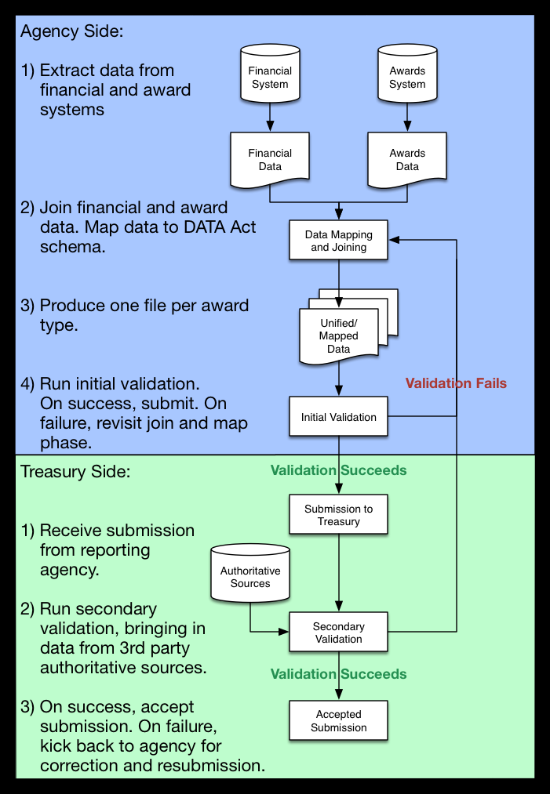

###Purpose

This will be a living doc outlining our current thoughts on the process and workflow of reporting agencies and Treasury regarding data unification, mapping, and validation.

####Assumptions and suggestions

For the sake of the pilot that 18F is currently involved in developing, we can make certain assumptions and decisions around how the data can be delivered to Treasury by the reporting agencies. Ultimately, these decisions lie with Treasury and the group responsible for developing the final ingestion and validation tools, but for now we can make certain suggestions regarding the data format and validation:

1. We suggest that those responsible for implementing the Data Act provide a simple, CSV based output format implementing the Data Act schema. Agencies should be able to map their existing data to this format prior to submission to Treasury. This format should require the joining of financial and award level data.

2. There should be one CSV file format that encompasses all award types (grant, loan, etc.). This will enable business rule validations.

3. We suggest that a validation tool should be made available to the reporting agencies. This tool could be applied to data represented in the csv format described above to do most validation prior to submission to Treasury. This should serve to assist agencies in making sure their data is correctly represented, and decrease the number of failed submissions.

4. Finally, after submission, Treasury should perform a secondary validation which would include all of the validation rules run by the aforementioned tool (to provide a sanity check), as well as any validations required against third party, authoritative sources (to be determined).

####Proposed workflow

####Input files

Per the decision points above, we're proposing that agencies submit DATA Act data using this proposed csv template:

[draft template](inventory_mapping.csv)

Note that the included fields will be revised once the DATA Act schema is finalized.

####Validation rules

Proposed rules are being documented at [sba-business-rules.md](../sba-business-rules.md).

####Validation script

An initial stab at a validator can be found at [processors/validator.py](../processors/validator.py). Rules are added as simple python objects, but could be pulled out of the script and parsed at runtime.
